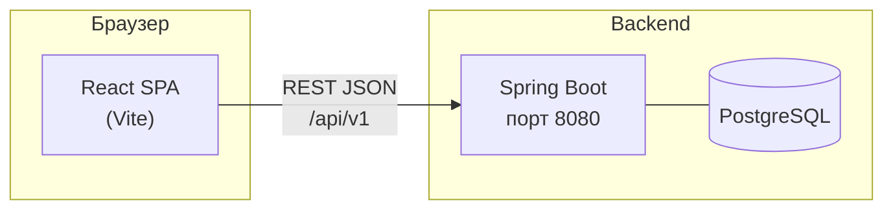
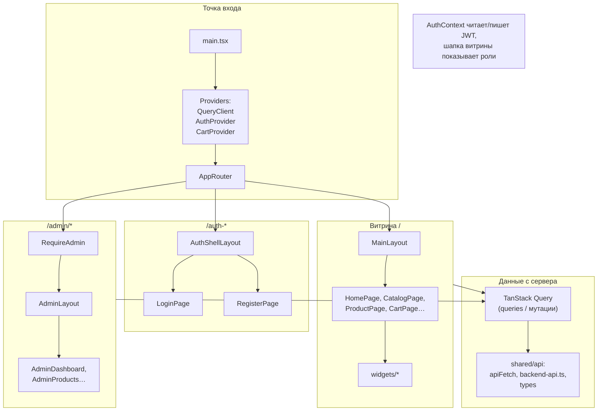
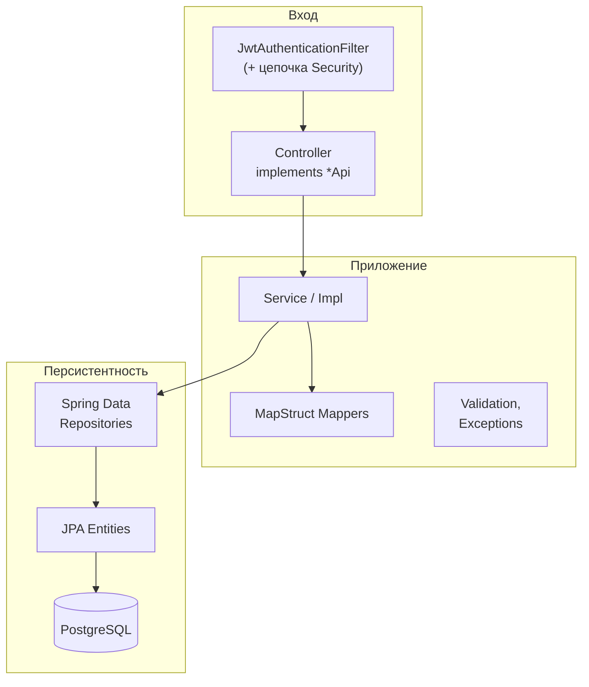
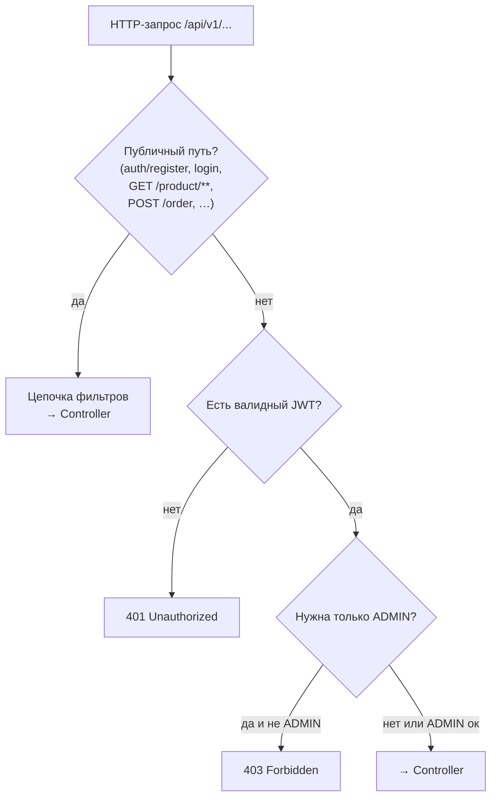

# Архитектура Balgyn801 (frontend + backend)

Ниже — схемы для быстрой навигации по системе. Рендер Mermaid поддерживают GitHub, многие IDE и плагины Markdown.

---

## 1. Контекст системы

Кто с чем говорит в типичном запуске (локально или Docker).

В продакшене перед приложением обычно стоят **reverse proxy** (HTTPS), возможно **CDN** для статики фронта.

---

## 2. Frontend — структура приложения

Один SPA, разные зоны по маршрутам.

**Идея:** витрина и админка **делят один HTTP-клиент и один базовый URL** (`VITE_API_BASE_URL`), но админские мутации всегда идут с **`Authorization: Bearer`**.

---

## 3. Backend — слои и поток запроса

Классический слой для REST-сервиса.

Контракт REST описан в интерфейсах **`api/*Api`** (и дублируется в OpenAPI для Swagger).

---

## 4. Безопасность: три типа вызовов

Упрощённая модель решений Security.

Точные правила задаются в **`SecurityConfig`**; список публичных/админских путей дублируется для разработчиков в **`frontend/…/backend-api.ts`** (`BACKEND_API`).

---

## 5. Связка «экран → эндпойнт» (примеры)

| Зона фронта | Типичные запросы |
|-------------|------------------|
| Каталог, карточка | `GET /product`, `GET /product/{id}` |
| Корзина → заказ (план) | `POST /order` |
| Вход / регистрация | `POST /auth/login`, `POST /auth/register` |
| После входа | `GET /auth/me` |
| Админ: товары | `POST /product`, `DELETE /product/{id}` (+ тот же `GET` для списка) |
| Админ: заказы (план) | `GET /order`, `GET /order/{id}` |

---

## Связанные документы

- [PLAN_AND_ARCHITECTURE.md](./PLAN_AND_ARCHITECTURE.md) — порядок задач и краткие схемы.
- Корневой [README.md](../README.md) — как запустить проект.
