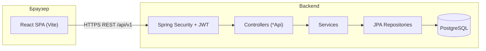
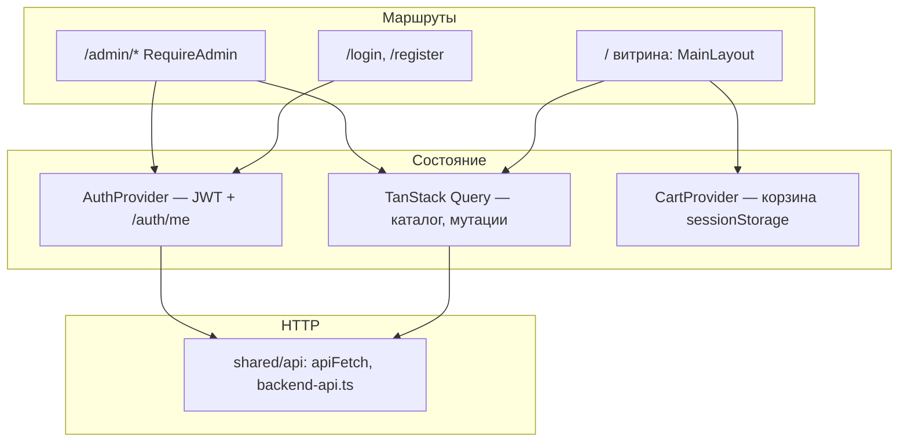
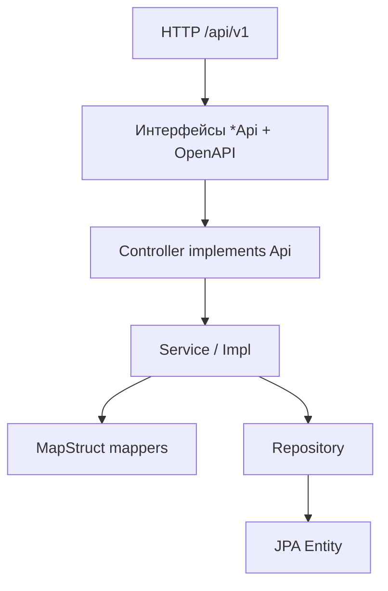

# План работ и архитектура Balgyn801

Документ для движения **строго по порядку**: отмечайте выполненное и переходите к следующему пункту.

---

## Архитектура «бэк + фронт»

### Общий поток

Публичные запросы (каталог, регистрация, создание заказа) проходят без токена там, где это разрешено в `SecurityConfig`. Защищённые и админские — только с заголовком **`Authorization: Bearer …`** и нужной ролью.

---

### Frontend (слои)

- **Витрина**: страницы в `frontend/src/pages/`, блоки в `widgets/`, общие UI в `shared/ui/`.
- **Админка**: `frontend/src/admin/` (layout, товары; дальше — заказы и т.д.).
- **Договор с бэком**: типы и функции в `shared/api/` (`BACKEND_API` — шпаргалка по путям).

---

### Backend (слои)

- **Безопасность**: `security/` — JWT фильтр, `UserDetails`, правила доступа.
- **Данные**: `domain/` + `repositories/`.

---

## Рабочий план по порядку

Логика: сначала закрываем **путь покупателя**, потом **медиа и админ-операционку**, потом **интеграции и прод**.

### Этап 0 — Уже сделано (референс)

- [x] Backend: Spring Security, JWT, роли USER/ADMIN, bootstrap-админ.
- [x] Backend: CRUD по домену через REST, OpenAPI (springdoc 3.x под Boot 4).
- [x] Frontend: каталог, карточка товара, корзина с позициями в `sessionStorage`.
- [x] Frontend: вход / регистрация, хранение токена, шапка, **`/admin`** только для ADMIN.
- [x] Frontend админка: добавление и удаление товаров (`POST/DELETE /product`).
- [x] Docker: multi-stage сборка backend-образа.

---

### Этап 1 — Оформление заказа с витрины

Цель: гость заполняет контакты и отправляет корзину на **`POST /order`**.

1. [x] Форма на странице корзины: имя, телефон, Telegram (необяз.), тип доставки (`PICKUP` / `TAXI` / `CDEK`), комментарий.
2. [x] Для **TAXI** и **CDEK** — адрес в запросе и сохранение в БД (`DeliveryAddress` ↔ `Order`); для **PICKUP** адрес не нужен. Ответ заказа включает `address` при доставке.
3. [x] Сбор **`items`**: `productId`, `quantity` из строк корзины (кастом-дизайн — позже).
4. [x] Вызов **`createOrder`**, успех: очистка корзины, экран «Заказ № …» + сумма и способ получения.
5. [x] Ошибки: текст из **`ApiError`** (в т.ч. типичный `detail` от ProblemDetail).

---

### Этап 2 — Файлы и картинки товаров

1. [ ] MinIO (или S3) в `docker-compose`, конфиг в Spring (endpoint, bucket, ключи из env).
2. [ ] Сервис загрузки: multipart или presigned URL → сохранение **`imageUrl`** / `objectKey` у продукта.
3. [ ] В админке вместо сырого URL — загрузка файла.

---

### Этап 3 — Админка: заказы и клиенты

1. [x] Страница списка заказов (`GET /order` — ADMIN), карточка заказа (`GET /order/{id}`).
2. [ ] При необходимости — новые эндпойнты смены статуса заказа (`PATCH` или отдельные действия), если текущего API мало.
3. [ ] Страница клиентов (`/customer/**`) по тем же правилам безопасности.

---

### Этап 4 — Учётные записи и прод-безопасность

1. [ ] Осознанный способ выдачи роли ADMIN (только доверенные сценарии: скрипт, первый deploy, отдельный защищённый эндпойнт).
2. [ ] Refresh-токены или короткий TTL access + политика повторного входа (по решению).
3. [ ] Прод: длинный `JWT_SECRET`, ограничение Swagger, CORS только боевые origin’ы, HTTPS.

---

### Этап 5 — Доставка и оплата

1. [ ] Клиент СДЭК + расчёт/ПВЗ (по вашей схеме из roadmap).
2. [ ] Платежи + webhook → смена статуса заказа → триггер отгрузки при схеме «сначала оплата».

---

## Как пользоваться этим файлом

1. Идите по этапам **1 → 2 → …**; внутри этапа — по пунктам сверху вниз.
2. После закрытия этапа можно коротко отметить это в корневом **README** в блоке дорожной карты.
3. Если меняется порядок (например сначала MinIO), зафиксируйте причину в коммите — чтобы команда не путалась.
