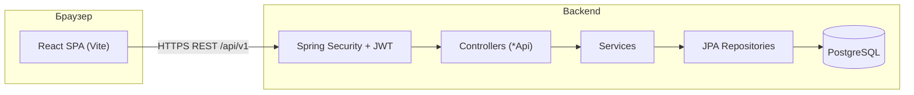
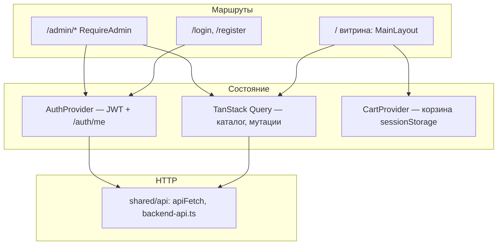
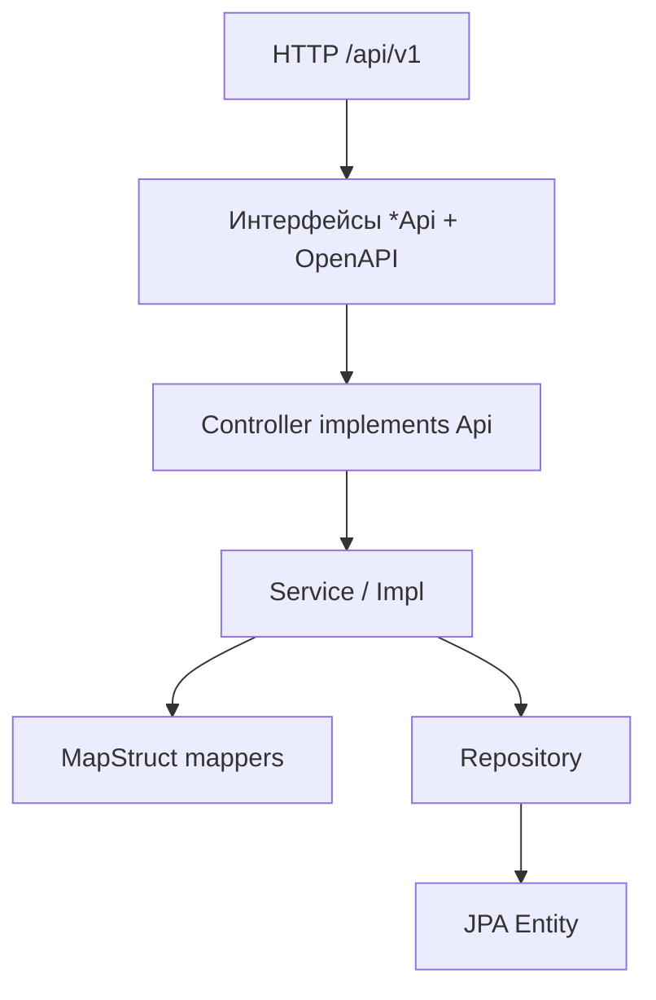

# План работ и архитектура Balgyn801

Документ для движения **строго по порядку**: отмечайте выполненное и переходите к следующему пункту.

---

## Архитектура «бэк + фронт»

### Общий поток



Публичные запросы (каталог, регистрация, создание заказа) проходят без токена там, где это разрешено в `SecurityConfig`. Защищённые и админские — только с заголовком **`Authorization: Bearer …`** и нужной ролью.

---

### Frontend (слои)



- **Витрина**: страницы в `frontend/src/pages/`, блоки в `widgets/`, общие UI в `shared/ui/`.
- **Админка**: `frontend/src/admin/` (layout, заказы, товары, клиенты).
- **Договор с бэком**: типы и функции в `shared/api/` (`BACKEND_API` — шпаргалка по путям).

---

### Backend (слои)



- **Безопасность**: `security/` — JWT фильтр, `UserDetails`, правила доступа.
- **Данные**: `domain/` + `repositories/`.

---

## Рабочий план по порядку

Логика: сначала закрываем **путь покупателя**, потом **медиа и админ-операционку**, потом **интеграции и прод**.

### Этап 0 — Уже сделано (референс)

- [x] Backend: Spring Security, JWT, роли USER/ADMIN, bootstrap-админ.
- [x] Backend: CRUD по домену через REST, OpenAPI (springdoc 3.x под Boot 4).
- [x] Frontend: каталог, карточка товара, корзина с позициями в `sessionStorage`.
- [x] Frontend: вход / регистрация, хранение токена, шапка, **`/admin`** только для ADMIN.
- [x] Frontend админка: добавление и удаление товаров (`POST/DELETE /product`).
- [x] Docker: multi-stage сборка backend-образа.

---

### Этап 1 — Оформление заказа с витрины

Цель: гость заполняет контакты и отправляет корзину на **`POST /order`**.

1. [x] Форма на странице корзины: имя, телефон, Telegram (необяз.), тип доставки (`PICKUP` / `TAXI` / `CDEK`), комментарий.
2. [x] Для **TAXI** и **CDEK** — адрес в запросе и сохранение в БД (`DeliveryAddress` ↔ `Order`); для **PICKUP** адрес не нужен. Ответ заказа включает `address` при доставке.
3. [x] Сбор **`items`**: `productId`, `quantity` из строк корзины (кастом-дизайн — позже).
4. [x] Вызов **`createOrder`**, успех: очистка корзины, экран «Заказ № …» + сумма и способ получения.
5. [x] Ошибки: текст из **`ApiError`** (в т.ч. типичный `detail` от ProblemDetail).

---

### Этап 2 — Файлы и картинки товаров

1. [x] MinIO (или S3) в `docker-compose`, конфиг в Spring (`application.properties` + env: endpoint, bucket, ключи).
2. [x] Сервис загрузки: `POST /api/v1/media/upload` (multipart) → публичный URL в **`imageUrl`** у продукта (`MinioMediaStorageService`, AWS SDK path-style).
3. [x] В админке — загрузка файла (превью, без ручного URL); при `STORAGE_ENABLED=false` загрузка отключена с понятной ошибкой.

---

### Этап 3 — Админка: заказы и клиенты

1. [x] Страница списка заказов (`GET /order` — ADMIN), карточка заказа (`GET /order/{id}`).
2. [x] Смена статуса заказа: `PATCH /order/{id}/status` (ADMIN), валидация терминальных статусов; UI на странице заказа в админке.
3. [x] Страница клиентов в админке: `GET/POST/PUT/DELETE /customer` — список, создание, редактирование, удаление (с учётом FK заказов).

---

### Этап 4 — Учётные записи и прод-безопасность

1. [x] Роль ADMIN раздаётся осознанно: `BootstrapAdminInitializer` только при пустой таблице `users`, дальше — защищённые `POST /api/v1/auth/admin/grant` и `POST /api/v1/auth/admin/revoke` (требуют ADMIN, нельзя снять у себя и у последнего админа). В админке (`AdminDashboardPage`) есть форма для выдачи/снятия по email.
2. [x] Refresh-токены: access короткий (по умолчанию 15 мин, `JWT_EXPIRATION_MS`), refresh длинный (по умолчанию 14 суток, `JWT_REFRESH_EXPIRATION_MS`), claim `typ=access|refresh`. Эндпойнт `POST /api/v1/auth/refresh`. На фронте refresh лежит в `localStorage` (`balgyn_refresh_token`), `apiFetch` при 401 один раз обновляет access и повторяет запрос; failed refresh → автологаут.
3. [x] Прод-безопасность: `JwtService` падает на старте, если `JWT_SECRET` < 32 байт; `WebConfig` берёт CORS-origin'ы из `ALLOWED_ORIGINS`; `SWAGGER_ENABLED=false` отключает springdoc и блокирует `/swagger-ui/**` и `/v3/api-docs/**` (HTTPS делается на уровне reverse-proxy при деплое).

---

### Этап 5 — Доставка и оплата

Цель: довести **Balgyn801** до сквозного потока в духе техдока «доставка + оплата» (референс по структуре: витрина вроде embroevch.ru — СДЭК, вебхуки, шлюзы по регионам). Ниже — **наш** чеклист; внешние URL и примеры тел — из публичной документации провайдеров, актуальность тарифов и полей API перепроверять перед продом.

#### 5.0 Продуктовые правила (зафиксировать в UI и текстах)

- [ ] РФ и СНГ: основной канал — **СДЭК**; при отсутствии ПВЗ в городе — **fallback** (Почта России / ручное оформление через менеджера — выбрать одну схему и описать на странице доставки).
- [ ] Международно: отдельный сценарий (менеджер / PayPal и т.д.) — не смешивать с RU-потоком без явного выбора страны.

#### 5.1 СДЭК API v2 (логистика)

Базовые URL: **production** `https://api.cdek.ru/v2/`, **sandbox** `https://api.edu.cdek.ru/v2/`.

- [x] Переменные окружения: `CDEK_BASE_URL` (sandbox по умолчанию), `CDEK_CLIENT_ID`, `CDEK_CLIENT_SECRET`, `CDEK_SENDER_CITY`, `CDEK_DEFAULT_TARIFF` (см. `application.properties`).
- [x] **OAuth 2.0** `POST /v2/oauth/token` (`grant_type=client_credentials`) с in-memory кешем токена в `CdekClient` (`expires_in` − 30 секунд буфера).
- [x] Бэкенд-обёртки под фронт: `GET /api/v1/delivery/cdek/cities?q=`, `GET /api/v1/delivery/cdek/points?cityCode=`, `POST /api/v1/delivery/cdek/calculate` — публичные, реализованы в `CdekDeliveryService` поверх `CdekClient`.
- [x] **Stub-режим без ключей**: если `CDEK_CLIENT_ID`/`CDEK_CLIENT_SECRET` пустые, сервис отдаёт мок-данные (`sourcedFromStub: true` в ответе калькулятора). Это разблокирует фронт checkout до получения sandbox-учётки.
- [ ] Создание отправления **`POST /v2/orders`**, статус/трек **`GET /v2/orders/{uuid}`**, при необходимости отмена **`DELETE /v2/orders/{uuid}`** — реализовать после успешной оплаты.
- [ ] **Вебхуки СДЭК**: регистрация **`POST /v2/webhooks`** (тип `ORDER_STATUS`), наш HTTPS endpoint `/api/v1/cdek/webhook`, маппинг кодов (`CREATED`, `ACCEPTED`, `IN_TRANSIT`, `RECEIVED_AT_PICKUP_POINT`, `DELIVERED`, `RETURN`, `INVALID`) → `CdekShipmentStatus` и `OrderStatus`.
- [ ] Выбор **тарифного кода** — сейчас дефолт 136 («склад-склад») в `CDEK_DEFAULT_TARIFF`. Финальный список тарифов закрепить в админке.

#### 5.2 Оплата — итерации по региону

**Итерация A — Россия (ЮKassa)**  
База: `https://api.yookassa.ru/v3/`, Basic Auth `shopId:secretKey`, заголовок **`Idempotence-Key`**.

- [ ] Env: `YOOKASSA_SHOP_ID`, `YOOKASSA_SECRET_KEY`, секрет для проверки вебхуков при необходимости.
- [ ] Создание платежа **`POST /v3/payments`** (`amount`, `confirmation.type=redirect`, `return_url`, `capture`, `metadata` с нашим `order_id`).
- [ ] Вебхук на наш бэкенд: события вроде `payment.succeeded`, `payment.canceled`, `payment.waiting_for_capture`, `refund.succeeded` → обновление заказа и разрешение шага «создать отправление СДЭК».

**Итерация B — Казахстан (Kaspi Pay)**  
Референс: `https://pay.kaspi.kz/api/v2`, валюта **KZT**, подпись **HMAC-SHA256** (заголовки `X-Auth-Token`, `X-Sign`, `X-Timestamp` — уточнить по официальной документации Kaspi).

- [ ] Env: `KASPI_API_KEY`, `KASPI_SECRET_KEY`, `KASPI_BASE_URL`.
- [ ] Создание платежа, редирект/QR при необходимости, опрос статуса, вебхук с проверкой подписи.

**Итерация C — международно (PayPal REST v2)**  
Production: `https://api-m.paypal.com`, sandbox: `https://api-m.sandbox.paypal.com`.

- [ ] Env: `PAYPAL_CLIENT_ID`, `PAYPAL_CLIENT_SECRET`, `PAYPAL_BASE_URL`.
- [ ] OAuth `POST /v1/oauth2/token`, заказы **`POST /v2/checkout/orders`**, capture **`POST /v2/checkout/orders/{id}/capture`**, вебхуки в кабинете PayPal.
- [ ] Учесть ограничения по регионам/счетам (актуальная политика PayPal и РФ — не копировать из референса без проверки юристом/бухгалтерией).

#### 5.3 Сквозной поток (реализация по шагам)

1. [ ] Оформление заказа на витрине (товар, размер/цвет, адрес) — база уже в этапе 1; при необходимости расширить поля под расчёт СДЭК.
2. [ ] **Расчёт доставки**: бэкенд → СДЭК calculator → показ суммы покупателю.
3. [ ] **Выбор оплаты** по правилу (RU → ЮKassa RUB, KZ → Kaspi KZT, EU/world → PayPal и т.д.).
4. [ ] Создание платежа в шлюзе → **redirect URL** на оплату.
5. [ ] **Вебхук оплаты** → пометка заказа «оплачен» / отмена.
6. [ ] **Создание заказа СДЭК** после успешной оплаты (если бизнес-правило «сначала оплата») → сохранение UUID/трека.
7. [ ] Уведомление клиента (email/Telegram — отдельным подпунктом этапа или здесь).
8. [ ] **Вебхук СДЭК** → обновление статуса доставки в БД.

#### 5.4 Сводка шлюзов (ориентир, не юридическая консультация)

| Параметр | ЮKassa | PayPal | Kaspi Pay |
|----------|--------|--------|-----------|
| Регион | РФ | вне РФ (политика уточняется) | KZ |
| Валюта | RUB | USD/EUR/GBP | KZT |
| Вебхуки | да | да | да |

Комиссии и доступность для ИП — **только из актуальных договоров** с провайдером.

#### 5.5 Переменные окружения (шаблон для `.env` / секретов деплоя)

```bash
# СДЭК
CDEK_CLIENT_ID=
CDEK_CLIENT_SECRET=
CDEK_BASE_URL=https://api.cdek.ru/v2

# ЮKassa
YOOKASSA_SHOP_ID=
YOOKASSA_SECRET_KEY=
YOOKASSA_WEBHOOK_SECRET=

# PayPal
PAYPAL_CLIENT_ID=
PAYPAL_CLIENT_SECRET=
PAYPAL_BASE_URL=https://api-m.paypal.com

# Kaspi Pay
KASPI_API_KEY=
KASPI_SECRET_KEY=
KASPI_BASE_URL=https://pay.kaspi.kz/api/v2
```

---

## Снимок «что осталось» (на 14.05.2026)

Этапы 0–4 закрыты, по 5-му сделана база. Ниже — единый список оставшихся работ, не повторяет чек-листы выше, а группирует по приоритету.

### A. Пользовательский поток (приоритет — сейчас)

1. [ ] **Checkout-страница на витрине** (после корзины): пошагово
   - выбор города через `searchCdekCities` (автодополнение),
   - выбор ПВЗ через `listCdekDeliveryPoints`,
   - расчёт суммы доставки через `calculateCdekTariff`,
   - показ итого «товары + доставка», переход к оплате.
2. [ ] **Расширить `CreateOrderRequest` и `Order`** полями для СДЭК: `cdekCityCode`, `cdekPointCode`, `deliveryCost`, `weightGrams` (или хранить выбранную точку отдельной сущностью).
3. [ ] **Поведение TAXI/PICKUP** — оставить ли «такси Алматы» и «самовывоз» как отдельные сценарии (UI/тексты).
4. [ ] **Тексты доставки на витрине** (страница «Доставка» / FAQ): KZ — СДЭК + самовывоз, fallback при отсутствии ПВЗ, международно — через менеджера.

### B. Оплата (Kaspi Pay в первую очередь — KZ)

1. [ ] Сущность `Payment` + `PaymentStatus` (`PENDING`, `SUCCEEDED`, `CANCELLED`, `REFUNDED`), `PaymentProvider` (`KASPI`, позже `YOOKASSA`, `PAYPAL`).
2. [ ] Интерфейс `PaymentGateway` (`init(order)`, `parseWebhook(req, body)`).
3. [ ] `KaspiGateway` + `KaspiClient`: env (`KASPI_API_KEY`, `KASPI_SECRET_KEY`, `KASPI_BASE_URL`), создание платежа, опрос/редирект.
4. [ ] `POST /api/v1/payments/init` (после оформления заказа) и `POST /api/v1/payments/webhook/kaspi` с проверкой подписи (HMAC).
5. [ ] FSM заказа: добавить `AWAITING_PAYMENT`, `PAID`; вебхук Kaspi → `PAID`.
6. [ ] Stub-режим Kaspi без ключей — чтобы фронт можно было дотестить локально.

### C. СДЭК — хвост 5.1

1. [ ] **Реальные ключи в env** (`CDEK_CLIENT_ID`, `CDEK_CLIENT_SECRET`) → проверить, что `sourcedFromStub: false`.
2. [ ] `POST /v2/orders` (создание отправления **после оплаты**), `GET /v2/orders/{uuid}` (трек), при необходимости `DELETE`. Хранить `cdekOrderUuid`, `trackingNumber` в `CdekShipment` (уже есть поля).
3. [ ] Вебхук `POST /api/v1/cdek/webhook` + регистрация `POST /v2/webhooks` (тип `ORDER_STATUS`) → маппинг кодов → `CdekShipmentStatus` и `OrderStatus`.
4. [ ] При необходимости — список разрешённых тарифов в админке (сейчас один дефолт `136`).

### D. Прочее / прод

1. [ ] HTTPS у публичного URL (на reverse-proxy) — нужен для вебхуков СДЭК и Kaspi.
2. [ ] Идемпотентность вебхуков (таблица `processed_webhook_events (provider, event_id)`).
3. [ ] Уведомления клиенту (email/Telegram) после `PAID` и при смене статуса доставки — по желанию.
4. [ ] Очистка спорных UX-мест в личном кабинете/корзине (см. отдельный список «UI minor» при следующем заходе).

---

## Как пользоваться этим файлом

1. Идите по этапам **1 → 2 → …**; внутри этапа — по пунктам сверху вниз.
2. После закрытия этапа можно коротко отметить это в корневом **README** в блоке дорожной карты.
3. Если меняется порядок (например сначала MinIO), зафиксируйте причину в коммите — чтобы команда не путалась.
